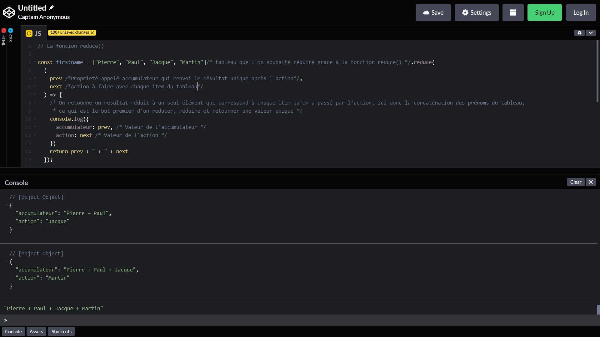

## Pourquoi ce projet

Je travail actuellement à la réalisation d'un eBook sur React,
un de plus me direz-vous et je ne vous contredirais pas, mais après en avoir lu quelques uns
j'ai pu me rendre compte que les contenus sont de manière général
toujours les mêmes.

Le tronc commun, les bases qui permettront d'utiliser la librairie
et réaliser quelques projets sympas mais dès lors que vou souhaitez aller un peu plus loin
dans la connaissance et la pratique, alors là ça devient plus difficile.

## React avancé, la paradis de la redondance

La plupart des leçons dîtes avancées sur React, ne vont que rarement
au-delà de l'utilisation des hooks, de redux ou du testing.

C'est donc pour cela que j'ai voulu me lancer dans l'aventure de l'écriture
afin de répondre à toutes les questions que je me pose, et que beaucoup se posent
pour devenir, à l'instar de Javascript, un ninja React.

## Exemple de schémas

